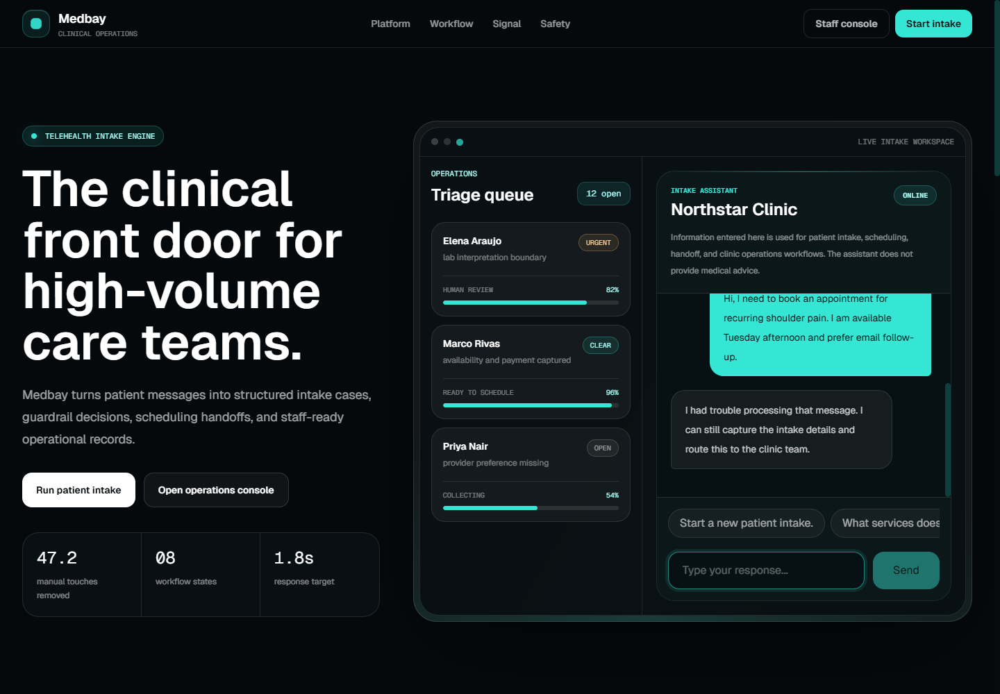
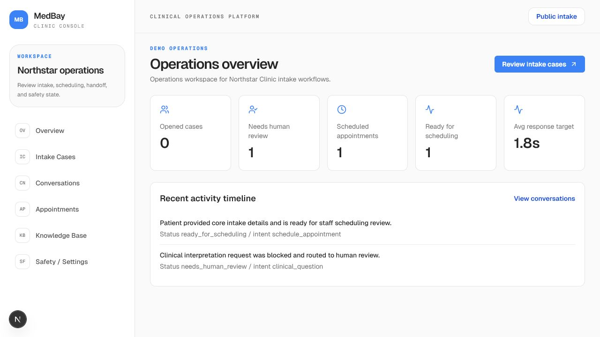
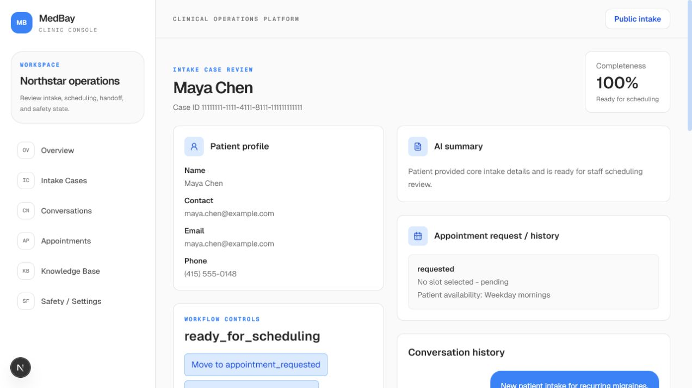

# Medbay

[](https://github.com/DerMayer1/Medbay/actions/workflows/ci.yml)
[](LICENSE)
[](https://nextjs.org/)
[](https://www.typescriptlang.org/)

Medbay 2.2.0 is a synthetic Stage 1 prototype for source-linked cardiology visit preparation. It validates the safety-critical path before any clinic pilot: born-digital PDF boundaries, page-level evidence, strict brief schemas, deterministic citation checks, clinician-only review, immutable versions, and auditable decisions.

The reference clinic is fictional: **Northstar Clinic**.

Live demo: [medbay-helix.vercel.app](https://medbay-helix.vercel.app/)

## Product Preview

### Patient Intake Assistant



### Staff Operations Console



### Source-linked Visit Preparation Review



## Why It Exists

Clinicians lose preparation time reconstructing context across intake forms, referrals, medication lists, and records. The operational problem is not generating another summary. Every displayed fact must remain traceable to an exact PDF page and quoted passage, and an identified clinician must approve the immutable version before export.

Medbay is built around one boundary:

- AI assists with administrative intake, source-bounded extraction, record organization, scheduling support, and handoff.
- Deterministic policies decide when to block, escalate, or ask for clarification.
- Staff prepare the case and an authorized reviewer explicitly approves or rejects the pre-consultation brief.

Medbay does **not** diagnose, calculate clinical risk, prescribe, recommend treatment, interpret clinical results, or replace professional care.

## Core Capabilities

- Public intake assistant with conversational data collection.
- Deterministic safety policy engine for clinical-risk boundaries.
- Structured intake extraction and completeness scoring.
- Born-digital PDF upload with type, size, signature, page and hashing checks.
- Deterministic, source-bounded brief drafting in which every fact quotes the sentence it came from.
- Strictly validated cardiology pre-consultation brief versions with exact page quotes.
- Clinician-only approval or rejection with a required reason and optimistic hash check.
- Intake case workflow with validated status transitions.
- Human handoff for unsafe, urgent, or staff-requested cases.
- Admin console for case queue, conversations, appointments, and knowledge base.
- Supabase-backed persistence with audit logs.
- OpenAI, Resend, and Google Calendar provider integrations.
- Degraded chat fallback when infrastructure providers are unavailable.

## Architecture

```text
Public intake assistant
  -> /api/chat thin route
  -> handlePatientMessage use case
  -> policy engine
  -> intake extraction
  -> intake workflow state machine
  -> AI provider
  -> repository adapters
  -> notifications / calendar providers
  -> audit events
  -> admin case review console
```

The Stage 1 visit-preparation path runs alongside it:

```text
Staff upload born-digital PDFs
  -> /api/intake-cases/[id]/documents
  -> PDF type, signature, size and page validation
  -> unpdf extraction -> document and page SHA-256
  -> attach_source_document (document + pages in one transaction)
  -> /api/intake-cases/[id]/brief
  -> deterministic source-bounded draft
  -> immutable brief version in needs_review
  -> clinician review -> review_brief_version RPC
  -> status + decision + audit event in one transaction
  -> print / export approved version
```

Business logic lives under `src/features/intake`. Route handlers stay thin, adapters isolate persistence and provider integrations, and the domain layer owns deterministic workflow and policy decisions.

The Stage 1 brief path lives under `src/features/briefs`. Its PDF boundary validates file type/size/magic bytes and hashes documents/pages after the `unpdf` extractor returns page text. Drafting is deterministic and source-bounded: every generated fact quotes the sentence it was derived from, so provenance holds by construction and is still verified independently before approval. An AI draft provider is intentionally not connected; that is Stage 2. The brief schema version stays at `2.0.1` — it is a data contract and does not track the release version.

Key files:

- `src/app/api/chat/route.ts` - public chat API route.
- `src/features/intake/application/handle-patient-message.ts` - main intake use case.
- `src/features/intake/domain/policy-engine.ts` - deterministic safety decisions.
- `src/features/intake/domain/intake-workflow.ts` - case status transitions.
- `src/features/intake/domain/intake-completeness.ts` - required field scoring.
- `src/features/intake/infrastructure/adapters.ts` - Supabase/OpenAI/Resend/Calendar adapters.
- `src/features/briefs/application/stage-1-pipeline.ts` - upload, extraction and version generation use cases.
- `src/features/briefs/application/validate-stage-1-input.ts` - PDF boundary and document budget.
- `src/features/briefs/domain/pre-consultation-brief.ts` - brief schema and provenance validation.
- `src/features/briefs/domain/deterministic-draft.ts` - source-bounded draft generation.
- `src/features/briefs/infrastructure/unpdf-extractor.ts` - born-digital PDF text extraction.
- `supabase/migrations` - database schema, RLS policies, immutability triggers and atomic RPCs.

## Domain Model

The product is modeled around intake operations rather than a generic lead funnel.

Core concepts:

- `Patient`
- `IntakeCase`
- `IntakeCaseStatus`
- `Conversation`
- `Message`
- `TriageAssessment`
- `HandoffRequest`
- `AppointmentRequest`
- `Appointment`
- `KnowledgeBaseItem`
- `AuditEvent`
- `SourceDocument` / `SourcePage`
- `BriefVersion` / `BriefReviewDecision`

The Supabase schema keeps the original `leads` table for backwards compatibility, but application code and UI expose the product domain as **Intake Cases**.

## Intake Workflow

Supported intake case statuses:

- `opened`
- `collecting_information`
- `needs_human_review`
- `ready_for_scheduling`
- `appointment_requested`
- `scheduled`
- `closed`
- `discarded`

Workflow transitions are deterministic in `src/features/intake/domain/intake-workflow.ts`. The admin case review console only presents valid next transitions, and the API rejects invalid transitions.

## AI Safety

The policy engine evaluates:

- clinical advice requests
- diagnosis requests
- medication requests
- exam or lab interpretation requests
- emergency red flags
- requests for human staff
- scheduling attempts without contact information
- low-confidence extraction

Policy decisions return `allow`, `block`, `escalate`, or `ask_clarifying_question`, plus severity, reason, handoff state, and safe response guidance. Assistant output is validated before it is persisted.

## Tech Stack

- Next.js App Router
- React
- TypeScript
- Tailwind CSS
- Supabase / PostgreSQL
- unpdf (born-digital PDF extraction)
- OpenAI API
- Resend
- Google Calendar API
- Zod
- Vitest
- PGlite (in-process PostgreSQL for database contract tests)
- Vercel

## Getting Started

```bash
npm install
cp .env.example .env.local
npm run dev
```

Open `http://localhost:3000`.

## Environment Variables

```env
NEXT_PUBLIC_APP_URL=http://localhost:3000
NODE_ENV=development
MEDBAY_CLINIC_ID=00000000-0000-4000-8000-000000000001

OPENAI_API_KEY=sk-...
OPENAI_MODEL=gpt-4o

NEXT_PUBLIC_SUPABASE_URL=https://your-project.supabase.co
NEXT_PUBLIC_SUPABASE_ANON_KEY=your_supabase_anon_key
SUPABASE_SERVICE_ROLE_KEY=your_supabase_service_role_key

RESEND_API_KEY=re_...
TEAM_EMAIL=ops@yourclinic.com
FROM_EMAIL=Medbay <noreply@yourdomain.com>

GOOGLE_CLIENT_ID=your_google_client_id
GOOGLE_CLIENT_SECRET=your_google_client_secret
GOOGLE_REFRESH_TOKEN=your_google_refresh_token
GOOGLE_CALENDAR_ID=primary
CLINIC_TIMEZONE=America/New_York
DEFAULT_APPOINTMENT_DURATION_MINUTES=45

ADMIN_EMAIL=
# Credential-less demo admin. Only "true" enables it; unset/false fails closed.
# Never enable in a deployment where the admin console can reach real data.
MEDBAY_PORTFOLIO_ADMIN=false
```

Provider configuration is explicit. Missing Supabase, OpenAI, Resend, or Google Calendar credentials fail fast inside provider modules. The public chat route may return a marked degraded response when infrastructure is unavailable so patients are not shown a raw failure.

## Scripts

```bash
npm run dev        # Start local development server
npm run build      # Create production build
npm run start      # Start production server
npm run typecheck  # Run TypeScript checks
npm run lint       # Run ESLint
npm test           # Run Vitest suite
```

## Testing

`npm test` runs the full suite, including the database contract tests. Those apply every
migration to an in-process PostgreSQL instance via PGlite and assert the immutability
triggers, clinic-scoped RLS, the document budget, the derived content digest, and
transaction rollback. No Docker or network access is required.

Supabase's hosted auth and storage are shimmed in that harness. `tests/integration/liveDatabase.test.ts`
covers that layer against a real project — storage policies, JWT-derived `auth.uid()`, and the
review RPC under real sessions. It passed against a managed project on 2026-08-04 and stays
skipped unless the following are set:

```bash
SUPABASE_TEST_URL=http://127.0.0.1:54321
SUPABASE_TEST_SERVICE_ROLE_KEY=...
SUPABASE_TEST_ANON_KEY=...
```

To produce them locally, run `npx supabase start` followed by `npx supabase db reset`.

## Production Notes

Implemented and testable in the synthetic Stage 1 scope:

- typed domain modules
- deterministic workflow validation
- deterministic safety policy engine
- thin route handler for chat
- Zod request validation
- Supabase-compatible persistence
- audit event model
- rate limiting and same-origin mutation checks
- strict brief and citation schemas
- a 12-case synthetic validation cohort covering every approved fact section
- PDF input boundary and document/page hashing behind an extractor port
- born-digital PDF extraction via unpdf, tested against real generated PDF bytes
- upload and generation endpoints with an admin upload panel, backed by one pipeline shared by the Supabase and synthetic stores
- deterministic source-bounded drafting; corrections create a new version rather than editing one
- clinician-only review endpoint with required reason and expected-content hash
- provenance re-verified before approval on both the authenticated and synthetic review paths
- normalized Supabase migration with private storage, clinic-scoped RLS, immutable records, and atomic review RPC
- database contract tests that apply every migration to an in-process PostgreSQL instance and assert immutability, clinic isolation, and transaction rollback

Not implemented or not yet validated:

- rate limits are process-local
- notifications are synchronous
- no live AI draft provider is connected to the Stage 1 brief pipeline; drafting is deterministic
- the migrations have been applied to exactly one managed Supabase project; nothing yet proves they apply cleanly to a second
- draft section routing is literal pattern matching evaluated in a fixed order, so a statement matching several sections is filed under the first rule that matches; clinician review is the control
- upload size is validated after the request body is read, so a request-size limit at the edge is still required
- OCR, EHR/FHIR ingestion, multi-clinic administration, and clinical interpretation remain outside Stage 1
- appointment requests do not require staff approval UI beyond status controls
- audit log rendering is intentionally minimal
- dependency audit is outstanding: `npm audit` reports known advisories in the current tree

For a production clinic deployment checklist, see `docs/production-readiness.md`.

## Documentation

- `docs/pivot-prd.md` - Medbay 2.x product direction, success gates, implementation truth, and delivery stages.
- `docs/supabase-validation-runbook.md` - applying the migrations to a managed Supabase project and closing the storage-policy and JWT auth gaps.
- `docs/product-spec.md` - product goals and acceptance criteria.
- `docs/architecture.md` - runtime and feature boundaries.
- `docs/domain-model.md` - product entities and workflow concepts.
- `docs/workflow.md` - intake state machine behavior.
- `docs/ai-safety.md` - AI safety and policy constraints.
- `docs/security-hardening.md` - security controls and Vercel firewall recommendations.
- `ARCHITECTURE.md` - high-level request flow.

## Architecture Decisions

**Why deterministic policy over pure LLM judgment**  
Clinical intake cannot rely on probabilistic AI output for safety decisions. The policy engine runs before and after the AI layer, making escalation and blocking decisions deterministic regardless of model behavior.

**Why use-case orchestration over route handlers**  
Business logic lives in `handlePatientMessage`, not in the Next.js route. This keeps the AI provider, repository, notification, and calendar adapters swappable without touching the domain.

**Why Supabase over a custom auth stack**  
Clinic staff authentication is not the product. Supabase handles it so the domain layer can focus on intake workflow and safety policy.

## License

This project is licensed under the MIT License. See [LICENSE](LICENSE).
